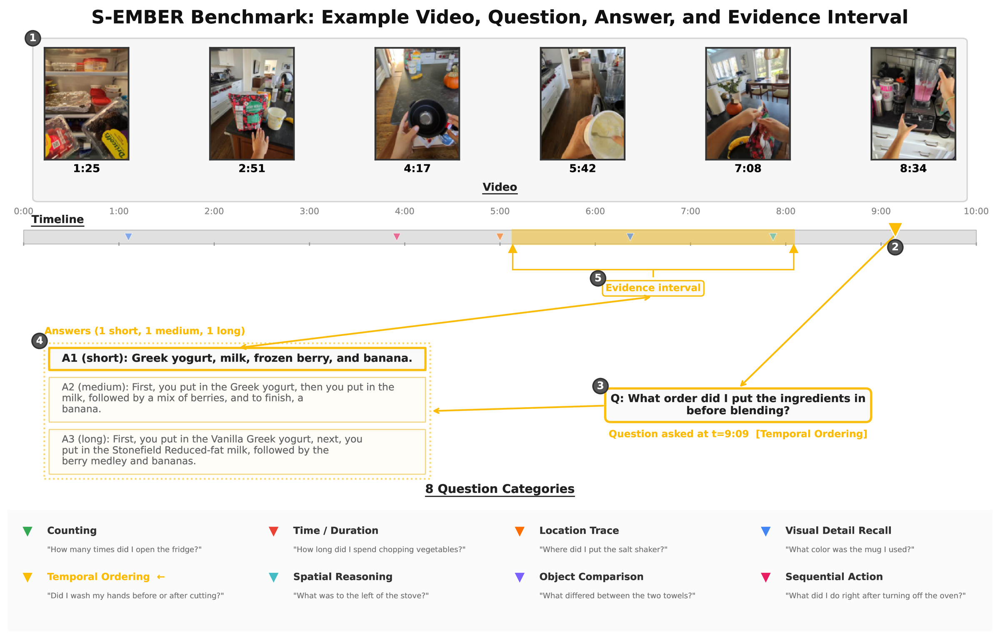

<div align="center">

# S-EMBER: A Large-Scale Benchmark for Streaming Egocentric Memory Retrieval

[Xiaodong Wang](https://scholar.google.com/citations?user=rMpcFYgAAAAJ&hl=en)<sup>1</sup>, [Xuanyi Zhao](https://scholar.google.com/citations?user=yxN5j-0AAAAJ&hl=en)<sup>1</sup>, [Pedro Rodriguez](https://www.pedro.ai/)<sup>1</sup>, [Devendra Singh Sachan](https://www.dsachan.com/)<sup>1</sup>, [Barlas Oguz](https://scholar.google.com/citations?user=iPmTQZMAAAAJ&hl=en)<sup>1</sup>, [Seungwhan Moon](https://shanemoon.com/)<sup>2</sup>, [Shang-Wen Li](https://swdanielli.github.io/)<sup>1</sup>, [Gargi Ghosh](https://scholar.google.com/citations?user=k5akwCcAAAAJ&hl=en&oi=ao)<sup>1</sup>, [Xin Dong](https://scholar.google.com/citations?user=uGsKvHoAAAAJ&hl=en)<sup>2</sup>, [Wen-Tau Yih](https://scottyih.org/)<sup>1</sup>

<sup>1</sup> FAIR, Meta &nbsp;&nbsp; <sup>2</sup> Reality Labs, Meta

<a href="https://github.com/facebookresearch/S-EMBER"></a>
<a href="https://arxiv.org/abs/2607.02689"></a>
<a href="https://huggingface.co/datasets/facebook/S-EMBER"></a>



</div>

<div align="left">
  <sub><em><strong>Overview of the S-EMBER benchmark annotation.</strong> Annotators issue memory questions in a streaming fashion across 8 color-coded categories. Each question is answered by multiple raters at varying verbosity and grounded to a supporting temporal interval as visual memory evidence: (1) a 5--20 minute video, (2) a query time, (3) a streaming memory question, (4) three acceptable answers, and (5) an evidence interval.</em></sub>
</div>

<br>

S-EMBER evaluates **streaming episodic memory retrieval** in long-form egocentric video: given first-person video from wearable smart glasses, a model must answer questions using only frames available up to the query time and ground recall in time. The benchmark contains **3,141 videos**, **388 hours** of organic activity, and **9,448 QA pairs** spanning location trace, sequential action, counting objects/events, visual detail recall, temporal ordering, time duration, object comparison, and spatial-aware reasoning.

## Layout

```
.
├── pyproject.toml                          # upstream lmms-eval v0.7.1 metadata (enables `pip install -e .`)
├── lmms_eval/                              # upstream lmms-eval (pinned to v0.7.1)
│   ├── models/simple/internvl3.py          # patched: video-trim & null-visual handling
│   ├── models/simple/qwen3_vl.py           # patched: video-trim, uniform_nframes, fixed_frame_pixels
│   └── tasks/sember/                       # NEW — S-EMBER tasks
│       ├── sember_mcq.yaml                 #   MCQ split
│       ├── sember_grounding.yaml           #   answer generation + temporal grounding
│       └── utils.py
├── scripts/
│   ├── run_mcq_smoke.sh                    # one-command MCQ smoke-test entry point
│   ├── data/
│   │   ├── download_data.sh                # prints Hugging Face download instructions
│   │   ├── place_data.sh                   # moves browser-downloaded files into the layout
│   │   └── filter_jsonl_by_videos.py       # restricts the JSONL to videos on disk
│   ├── mcq/
│   │   ├── run_internvl3_5.sh              # parameterised runner (4B / 8B / 38B)
│   │   ├── run_qwen3vl.sh                  # parameterised runner (4B / 8B / 32B)
│   │   └── slurm/
│   │       ├── internvl3_5.sbatch          # SLURM submission wrapper
│   │       └── qwen3vl.sbatch              # SLURM submission wrapper
│   └── grounding/
│       ├── run_internvl3_5.sh              # parameterised runner (4B / 8B / 38B)
│       ├── run_qwen3vl.sh                  # parameterised runner (4B / 8B / 32B)
│       └── slurm/
│           ├── internvl3_5.sbatch          # SLURM submission wrapper
│           └── qwen3vl.sbatch              # SLURM submission wrapper
├── tools/
│   ├── api_baseline.py                     # closed-source backends: Gemini / GPT-4o (mcq/grounding/pure_llm)
│   └── judge_grounding.py                  # OPTIONAL Gemini judge for grounding answer accuracy
├── data/
│   └── README.md                           # dataset format + how to obtain it
└── README.md
```

S-EMBER-specific task definitions live under `lmms_eval/tasks/sember/`. The model wrappers include lightweight changes for streaming evaluation, including clipping video inputs at `question_time`.

## Environment

The package targets Python ≥ 3.10. Create a fresh conda environment
(name it whatever you like — `sember` matches the task name and the
data directory):

```bash
conda create -n sember python=3.10 -y
conda activate sember
pip install -e ".[video,video-legacy]"
pip install -U huggingface_hub
```

## Data and MCQ Evaluation

```bash
# Download metadata.
huggingface-cli download facebook/S-EMBER sember_mcq.jsonl \
    --repo-type dataset --local-dir data
huggingface-cli download facebook/S-EMBER sember_grounding.jsonl \
    --repo-type dataset --local-dir data

# Download all videos. For a smoke test, you may instead download only a few
# mp4s from https://huggingface.co/datasets/facebook/S-EMBER/tree/main/videos
# and place them under data/videos/.
huggingface-cli download facebook/S-EMBER --repo-type dataset \
    --include 'videos/*.mp4' --local-dir data

# MCQ evaluation. Set NUM_PROCESSES to the number of GPUs to use.
NUM_PROCESSES=1 bash scripts/run_mcq_smoke.sh internvl3_5 4B
NUM_PROCESSES=1 bash scripts/run_mcq_smoke.sh qwen3vl 8B
```

`bash scripts/data/download_data.sh` prints the same download
commands and reports which local files are present. See `data/README.md`
for the JSONL schemas and troubleshooting.

Set `NUM_PROCESSES=N` to launch on `N` GPUs via `accelerate`. Qwen3-VL uses `flash_attention_2` in the provided runner, so install `flash-attn` before running Qwen3-VL. For small InternVL3.5 checks, reduce `NUM_FRAME` and `TOTAL_MAX_NUM` if GPU memory is limited.

The InternVL3.5 runner accepts these optional environment variables:

| Variable | Default | Purpose |
|----------|---------|---------|
| `SEMBER_OUTPUT_DIR` | `./output/mcq/internvl3_5_<size>` | Where samples + metrics json are written |
| `NUM_PROCESSES` | `8` | GPUs to launch via `accelerate` |
| `NUM_FRAME` | `128` | Frames sampled per video |
| `TOTAL_MAX_NUM` | `128` | Cap on total image tiles |

The Qwen3-VL runner accepts these optional environment variables:

| Variable | Default | Purpose |
|----------|---------|---------|
| `SEMBER_OUTPUT_DIR` | `./output/mcq/qwen3vl_<size>_uniform_<N>f_fixres` | Where samples + metrics json are written |
| `NUM_PROCESSES` | `8` | GPUs to launch via `accelerate` |
| `UNIFORM_NFRAMES` | `768` | Frames sampled uniformly per video |
| `FIXED_FRAME_PIXELS` | `786432` | Per-frame pixel budget |

See `data/README.md` for the JSONL schema.

## Grounding Evaluation

In addition to MCQ, S-EMBER ships a **grounding** task that asks the
model to produce both a free-text answer AND a temporal interval
`[t_start, t_end]` (in seconds) inside the source video where the
supporting evidence appears. This is the metric behind the paper's
"localization paradox" finding.

The grounding task uses `data/sember_grounding.jsonl` (which carries the
gold answer intervals `answer_start_time` / `answer_end_time`) and
reports **temporal IoU** by default — fully deterministic, no API key
required.

```bash
# Same data layout as MCQ (download the grounding jsonl + 1+ videos).
export SEMBER_VIDEO_DIR=$PWD/data/videos
NUM_PROCESSES=1 bash scripts/grounding/run_internvl3_5.sh 4B    # InternVL3.5
NUM_PROCESSES=1 bash scripts/grounding/run_qwen3vl.sh    8B     # Qwen3-VL
```

Other model choices:
  * `NUM_PROCESSES=1 bash scripts/grounding/run_internvl3_5.sh {4B|8B|38B}` for single-GPU smoke tests
  * `NUM_PROCESSES=1 bash scripts/grounding/run_qwen3vl.sh     {4B|8B|32B}` for single-GPU smoke tests
  * omit `NUM_PROCESSES=1` or set `NUM_PROCESSES=N` for multi-GPU runs

### Optional: answer-correctness via Gemini judge

To additionally score the free-text answer field for correctness, run
the optional `tools/judge_grounding.py` script on the per-sample jsonl
emitted by the grounding runner. The paper setting uses Gemini 3.1 Flash
as the judge. This step requires a Google Gemini API key but is **not**
required to reproduce the temporal-IoU numbers:

```bash
pip install google-genai
export GEMINI_API_KEY=<your-key>

python tools/judge_grounding.py \
    output/grounding/internvl3_5_4b/<model_dir>/<timestamp>_samples_sember_grounding.jsonl \
    --out judge_results.json
```

Reads from the `_samples_sember_grounding.jsonl` produced by lmms-eval
and prints accuracy overall and per question category. Per-sample
verdicts are written to `<input>.judged.jsonl` for inspection.

The grounding runners accept the same core environment variables as the MCQ runners, including `SEMBER_OUTPUT_DIR` and `NUM_PROCESSES`.

## API Baselines

`tools/api_baseline.py` runs Gemini and GPT-4o baselines for MCQ, grounding, and pure-LLM settings.

```bash
# Gemini video QA: upload 720p video.
GEMINI_API_KEY=... python tools/api_baseline.py mcq --model gemini --resolution 720

# GPT-4o video QA: use 50 uniformly sampled frames.
AZURE_OPENAI_ENDPOINT=https://<your-host> AZURE_OPENAI_API_KEY=... \
    python tools/api_baseline.py mcq --model gpt4o --max-frames 50

# GPT-4o pure-LLM floor: no video input.
AZURE_OPENAI_ENDPOINT=https://<your-host> AZURE_OPENAI_API_KEY=... \
    python tools/api_baseline.py pure_llm --model gpt4o --mode mcq
```

Install the API SDKs with `pip install google-genai openai decord pillow`. Outputs are written to `output/api/` by default.

## Citation

If you use S-EMBER, please cite:

```bibtex
@article{wang2026sember,
  title = {S-EMBER: A Large-Scale Benchmark for Streaming Egocentric Memory Retrieval},
  author = {Wang, Xiaodong and Zhao, Xuanyi and Rodriguez, Pedro and Sachan, Devendra Singh and Oguz, Barlas and Moon, Seungwhan and Li, Shang-Wen and Ghosh, Gargi and Dong, Xin and Yih, Wen-Tau},
  journal = {arXiv preprint arXiv:2607.02689},
  year = {2026},
  url = {https://arxiv.org/abs/2607.02689}
}
```

## Acknowledgments

This repository builds on the open-source [`lmms-eval`](https://github.com/EvolvingLMMs-Lab/lmms-eval) framework, pinned to `v0.7.1`. We thank the lmms-eval authors and community for making their evaluation framework available.

## License

The majority of S-EMBER is licensed under [CC BY-NC 4.0](https://creativecommons.org/licenses/by-nc/4.0/), however portions of the project are available under separate license terms: lmms-eval is subject to the licenses listed at [https://github.com/EvolvingLMMs-Lab/lmms-eval?tab=License-1-ov-file#readme](https://github.com/EvolvingLMMs-Lab/lmms-eval?tab=License-1-ov-file#readme); lm-evaluation-harness is licensed under the MIT license [https://github.com/EleutherAI/lm-evaluation-harness/blob/main/LICENSE.md](https://github.com/EleutherAI/lm-evaluation-harness/blob/main/LICENSE.md).

The S-EMBER dataset is distributed on Hugging Face under the license and gated access terms listed on the [dataset page](https://huggingface.co/datasets/facebook/S-EMBER).
